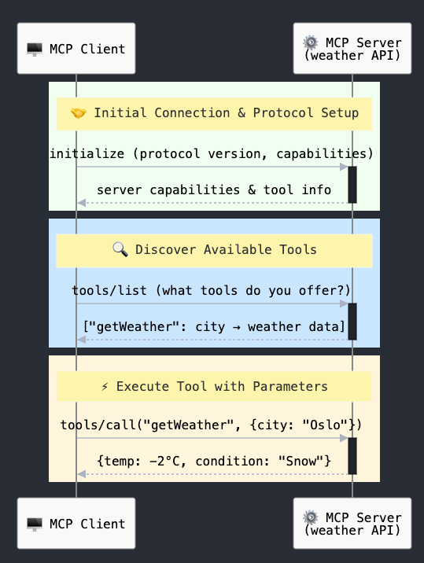
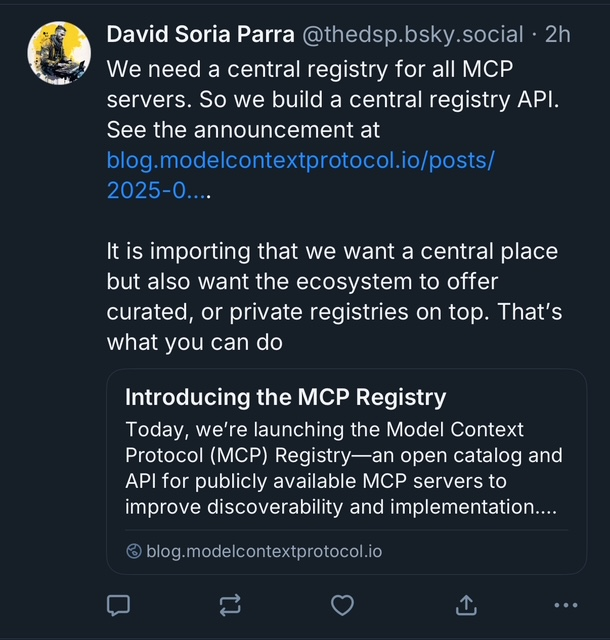
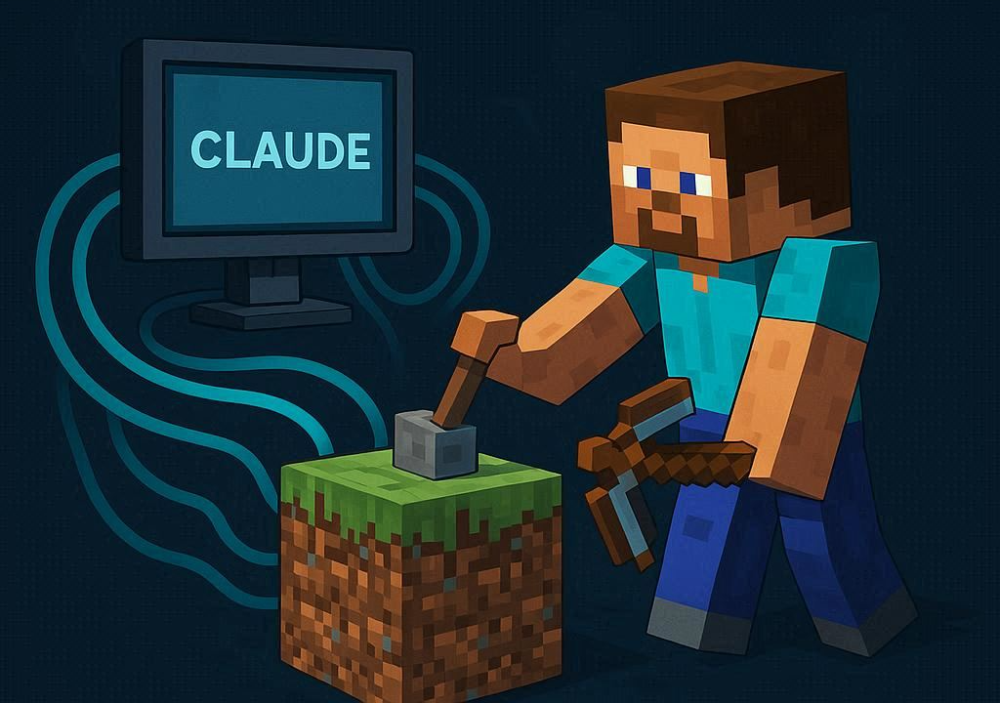

<!-- _paginate: false -->
<!-- _footer: '' -->

# From Concept to Code <span class="extended-text" id="extended">(Extended)</span>
## Implement Your Own MCP Server 💻

<br>

**JavaZone 2025** ☕

<br>

**Jarle Hansen**

---

# **Agenda** 📋

<div style="font-size: 26px; line-height: 1.4;">

1. 🔍 **Problem and solution**

2. 🛠️ **Technical overview**

3. 💻 **Practical demo**

4. 🌐 **Alternatives for MCP implementation**

5. 🏁 **Wrap-up**

</div>

---

# ✨ What is Model Context Protocol?

- **Launched November 2024** by Anthropic
<br>
- **The Problem**: AI tools live in isolation without access to your data and systems
<br>
- **The Solution**: Standardized way for AI models to communicate with external systems

---

# Model Context Protocol


---

# **Official MCP Servers**

<div class="columns">
<div>

### **🗄️ Database**
PostgreSQL, SQLite, MongoDB

### **🛠️ Dev Tools**
GitHub, Git, Puppeteer, Context 7

</div>
<div>

### **💼 Business**
Slack, Google Drive, Gmail

### **🌐 Web/API**
Brave Search, Fetch, Time

</div>
</div>

<br>

##### **🔗 [github.com/modelcontextprotocol/servers](https://github.com/modelcontextprotocol/servers)**

---


# **Transport Layer** 🚚

<div class="columns">
<div>

## 📡 **Stdio Transport**
- Good performance, no network overhead
- Direct communication between local processes

</div>
<div>

## 🌐 **HTTP Transport**
- HTTP POST from client to server
- Streamable HTTP implementation, e.g., Server-Sent Events (SSE)
- Authentication: OAuth, API keys, custom headers

</div>
</div>

### **🔑 JSON-RPC 2.0 format on both**

---

# **Lifecycle**

<div class="columns">
<div>



</div>
<div>

<br>

**1. Initialization** - The client connects to the MCP server and establishes communication
*(Claude Desktop, Claude Code, <br>VS Code...)*

<br>

**2. Discovery** - The server exposes available tools/resources/prompts

<br>

**3. Execution** - The client calls tools and receives the result

</div>
</div>


---

# **Demo: JavaZone MCP Server**

<style scoped>
.process-steps {
  text-align: left;
  font-size: 26px;
  line-height: 1.8;
}

.process-steps > div {
  opacity: 0;
  transform: translateX(-40px);
  animation: slideInStep 0.6s ease-out forwards;
}

.process-steps > div:nth-child(1) { animation-delay: 0.2s; }
.process-steps > div:nth-child(3) { animation-delay: 0.5s; }
.process-steps > div:nth-child(5) { animation-delay: 0.8s; }

@keyframes slideInStep {
  0% {
    opacity: 0;
    transform: translateX(-40px);
  }
  100% {
    opacity: 1;
    transform: translateX(0);
  }
}

/* Hover effect for interactivity */
.process-steps > div:hover {
  transform: translateX(10px);
  transition: transform 0.2s ease;
}
</style>

<div class="process-steps">

<div>📊 <strong>Find general information about the conference</strong></div>

<br>

<div>🔍 <strong>Search for presentation details for a speaker</strong></div>

<br>

<div>💻 <strong>IntelliJ as MCP server (from version 2025.2)</strong></div>

</div>

---

<div style="text-align: center; margin: 40px 0;" class="at-this-point-quote">

<div class="quote-text">
<h2>💬 "At this point, I wanted to start building! So, I went to my second favorite place on the internet, the Spring Initializr - <span class="quote-highlight"><a href="https://start.spring.io"><strong>start.spring.io</strong></a></span>"</h2>
</div>

<br>

<div class="josh-long-signature">
<h5><strong>— Josh Long, Spring Developer Advocate</strong> 🌱</h5>
</div>

</div>

---

# **Other Alternatives for MCP Servers**

<div class="columns">
<div>

### **🟢 Node.js/TypeScript**
```typescript
import { Server } from '@modelcontextprotocol/sdk'

const server = new Server({
  name: 'my-server'
})
```

### **🔵 Python**
```python
from mcp import Server

server = Server("my-server")

@server.tool()
def search_data(query: str):
    return results
```

</div>
<div>

### **🔷 Go**
```go
package main

import "github.com/modelcontextprotocol/go-sdk"

func main() {
    server := mcp.NewServer("my-server")
    server.AddTool("search", searchHandler)
}
```

### **🟣 C#/.NET**
```csharp
var builder = Host.CreateApplicationBuilder();
builder.Services.AddMcpServer("my-server");

var app = builder.Build();
```

</div>
</div>

---

# **Best Practices**

<div class="columns">
<div>

### **🎯 Design & Implementation**
- Create tools for entire workflows
- Describe tools clearly with action-oriented names
- Robust error handling and validation
- Log to stderr (not stdout)

</div>
<div>

### **📈 Scalability & Security**
- Use namespace organization (`files/read`, `db/query`)
- Consider multiple MCP servers for large systems
- For remote servers, remember authentication

</div>
</div>

---

<!-- _footer: '' -->

# **🏪 MCP Registry (09/09-2025)**



##### **🔗 [https://registry.modelcontextprotocol.io](https://registry.modelcontextprotocol.io)**

---

# **MCP Registry Preview** 🚀

<br>

- **🌐 Centralized source of truth** for MCP ecosystem discovery

<br>

- **📦 Open catalog and API** for publicly available MCP servers

<br>

- **🤝 Community-driven** with 16+ contributors from 9+ companies

<br>

- **🔧 Flexible registry options** supporting public and private sub-registries

---

<iframe src="http://localhost:8080/mcp-registry.html" width="100%" height="600" style="border: none;"></iframe>

---

# **Security**

**Security best practices  🔒**
https://modelcontextprotocol.io/specification/latest

<br>

**Only use MCP from trusted sources**

---

# **Summary**

- 🌐 **MCP standardizes AI integrations** - one protocol for all

<br>

- 🔓 **Open standard** - no vendor lock-in, broad support

<br>

- 🚀 **Demo: Kotlin + Spring AI**, easy to get started

<br>

- 💻 **Multiple implementations available** in various languages

<br>

- 🔒 **Consider security**


---

# **Thank You** 🙏

<div style="text-align: left; margin: 0 auto; width: 85%;">

##### **References**
🔗 `modelcontextprotocol.io`
🔗 `docs.spring.io/spring-ai/reference`

<br>

##### **Contact**
**Jarle Hansen**
📧 Email: jarle@jarlehansen.net

</div>

