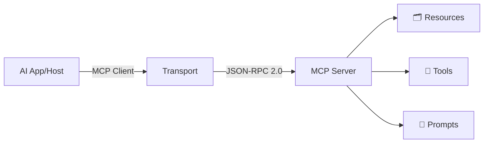

<!-- _paginate: false -->
<!-- _footer: '' -->

# Fra Konsept til Kode
## Implementer din egen MCP-server 

<br>

**JavaZone 2025**

<br>

**Jarle Hansen**
**Systek**

---

# **Agenda** 📋

- ✨ **Hva er MCP** - Og hvorfor er det nyttig
- 🚀 **Hvordan fungerer det** 
- 🔧 **Live Demo** - Lage vår egen MCP
  - Bruk av Spring AI
  - Integreres med Claude desktop
- ⚡ **Alternativer** - Koog & eksisterende servere
- 🏭 **Produksjon** - Tips og beste praksis

---

# **Problemet** 😰

<div style="font-size: 24px;">

```
     AI Modeller                  Datakilder
   
   Claude ─────┬─────────┬──────── Database
               │         │
   GPT-4 ──────┼─────────┼──────── API-er
               │         │
   Gemini ─────┼─────────┼──────── Filer
               │         │
   Llama ──────┴─────────┴──────── Slack
```

</div>

## **= 16 custom integrasjoner! 😱**

Hver med egen auth, error handling, rate limiting...

---

# **Hva skjer når vi skalerer?** 📈

<div class="columns">
<div>

### **10 AI-modeller**
### **× 50 datakilder**
### **= 500 integrasjoner**

</div>
<div>

### Hver integrasjon:
- Egen implementering
- Egen vedlikehold
- Egen dokumentasjon
- Egen testing

</div>
</div>

## **Dette skalerer ikke!** ⚠️

---

# **Løsningen: MCP** 🎉

<div style="font-size: 24px;">

```
     AI Modeller          MCP           Datakilder
   
   Claude ──┐                    ┌──── Database
            │                    │
   GPT-4 ───┼──── [MCP Hub] ─────┼──── API-er
            │                    │
   Gemini ──┼                    ├──── Filer
            │                    │
   Llama ───┘                    └──── Slack
```

</div>

## **= Én standard protokoll!** ✨

Lansert av Anthropic, 25. november 2024

---

# **MCP Status 2025** 📊

<div class="columns">
<div>

### **Adoption**
- ✅ Anthropic (Claude)
- ✅ OpenAI (mars 2025)
- ✅ Microsoft 
- ✅ JetBrains (Koog)
- 🔄 Google (vurderer)

</div>
<div>

### **Økosystem**
- 1000+ MCP servere
- 10+ frameworks
- TypeScript, Python, Java, Go, C#
- Aktiv community
- Rask vekst

</div>
</div>

---

# **Hvordan fungerer MCP?** 🔧



<div style="font-size: 24px; margin-top: 20px;">

**Transport**: STDIO (lokal) eller SSE (remote)
**Protocol**: JSON-RPC 2.0 over transport
**Format**: Standardisert request/response

</div>

---

# **MCP Byggeklosser** 🏗️

<div style="text-align: left; margin: 0 auto; width: 90%;">

## 🗂️ **Resources**
Statisk innhold: dokumenter, konfigurasjon, data

## 🔨 **Tools**  
Funksjoner AI kan kalle: søk, opprett, oppdater

## 💬 **Prompts**
Forhåndsdefinerte templates for spesifikke oppgaver

</div>

---

# **Spring AI MCP** 🌱

<div style="text-align: left; margin: 0 auto; width: 85%;">

### **Hvorfor Spring AI?**

✅ Kjent programmeringsmodell (@Tool, @Component)

✅ Spring Boot auto-configuration

✅ Production-ready (metrics, security, tracing)

✅ Sømløs integrasjon med eksisterende kode

✅ Støtte for både Kotlin og Java

</div>

---

# **La oss bygge!** 🚀

## **Demo: HR-system MCP Server**

<div style="text-align: left; margin: 0 auto; width: 80%;">

**Use case**: AI-assistent for HR

**Funksjoner**:
- Søke etter ansatte
- Sjekke feriestatus
- Finne team-medlemmer
- Hente avdelingsinfo

**Stack**: Spring Boot 3.3 + Kotlin + H2

</div>

---

# **Steg 1: Dependencies** 📦

```xml
<dependency>
    <groupId>org.springframework.ai</groupId>
    <artifactId>spring-ai-starter-mcp-server-webmvc</artifactId>
    <version>0.1.0</version>
</dependency>
```

```yaml
spring:
  ai:
    mcp:
      server:
        type: SYNC
        transport:
          sse:
            path: /mcp/sse
```

---

# **Steg 2: Implementer Tool** 🔨

```kotlin
@Component
class HRTools(private val hrService: HRService) {
    
    @Tool(description = "Søk etter ansatte")
    fun searchEmployees(
        @ToolParam(description = "Søkeord") 
        query: String
    ): List<Employee> {
        return hrService.searchEmployees(query)
    }
    
    @Tool(description = "Hent feriestatus")
    fun getVacationStatus(
        @ToolParam(description = "Ansatt-ID") 
        employeeId: String
    ): VacationInfo {
        return hrService.getVacationInfo(employeeId)
    }
}
```

---

# **Steg 3: Resources** 📚

```kotlin
@Component
class HRResourceProvider : ResourceProvider {
    
    override fun getResources(): List<Resource> {
        return listOf(
            Resource(
                uri = "hr://policies/handbook",
                name = "Personalhåndbok",
                description = "HR-policies og regler",
                mimeType = "text/markdown"
            )
        )
    }
    
    override fun readResource(uri: String): ResourceContent {
        return when(uri) {
            "hr://policies/handbook" -> loadHandbook()
            else -> throw ResourceNotFoundException(uri)
        }
    }
}
```

---

# **Steg 4: Claude Config** 🤖

```json
{
  "mcpServers": {
    "hr-system": {
      "command": "java",
      "args": ["-jar", "hr-mcp-server.jar"],
      "env": {
        "SERVER_PORT": "8080"
      }
    }
  }
}
```

**Lokasjon:**
- Windows: `%APPDATA%/Claude/claude_desktop_config.json`
- Mac: `~/Library/Application Support/Claude/`
- Linux: `~/.config/Claude/`

---

# **Demo Time!** 🎯

<div style="font-size: 36px; margin: 40px 0;">

### La oss teste med Claude! 

</div>

<div style="text-align: left; margin: 0 auto; width: 80%;">

**Spørsmål vi kan stille:**

1. "Hvem jobber i IT-avdelingen?"
2. "Når har Erik ferie?"
3. "Finn alle senior developers"
4. "Vis team-strukturen"

</div>

---

# **Alternativ: Koog** 🎯

## JetBrains' Kotlin-first AI Framework

```kotlin
@Agent
class HRAgent : KoogAgent() {
    
    @McpTool("Search employees")
    suspend fun searchEmployees(query: String): List<Employee> {
        return withContext(Dispatchers.IO) {
            database.query(query)
        }
    }
}
```

✅ Native Kotlin coroutines
✅ Multiplatform (Android, JVM, JS)
✅ IntelliJ integration

---

# **Eksisterende MCP-servere** 📚

<div class="columns">
<div>

### **Databaser**
- PostgreSQL
- MongoDB  
- SQLite
- Redis

### **Dev Tools**
- GitHub
- Git
- Puppeteer

</div>
<div>

### **Business**
- Slack
- Google Drive
- Stripe
- Brave Search

### **Bruk dem!**
```yaml
brave-search:
  command: npx
  args: 
    - "@modelcontextprotocol/
       server-brave-search"
```

</div>
</div>

---

# **Produksjons-tips** 🏭

<div class="columns">
<div>

### **Sikkerhet**
```kotlin
@Tool
@RequiresAuth
@RateLimit(100, "1h")
fun sensitiveOp()
```

### **Ytelse**
- Cache responses
- Paginer data
- Async I/O

</div>
<div>

### **Observability**
```kotlin
@Tool
@Timed("mcp.tool")
@Counted("mcp.calls")
fun trackedOp()
```

### **Testing**
- Unit tests for tools
- Integration tests
- Contract testing

</div>
</div>

---

# **Best Practices** ✅

<div style="text-align: left; margin: 0 auto; width: 85%;">

### **DO's** 👍
- Beskriv tools godt - AI trenger kontekst
- Valider all input - alltid!
- Implementer paginering
- Bruk semantic versioning
- Logg for debugging og compliance

### **DON'Ts** 👎
- Eksponere sensitive operasjoner uten auth
- Returnere for store datasett
- Hardkode credentials
- Ignorere error handling

</div>

---

# **MCP Roadmap** 🗺️

<div class="columns">
<div>

### **Levert (2025)**
✅ OAuth 2.1
✅ Streaming
✅ OpenAI adoption
✅ Spring AI support

</div>
<div>

### **Kommer**
🔄 Tool discovery
🔄 Federated networks
🔄 Native IDE-støtte
🔄 Better debugging

</div>
</div>

<br>

## **1000+ servere og økende!** 📈

---

# **Oppsummering** 🎯

<div style="font-size: 30px; text-align: left; margin: 0 auto; width: 85%;">

✅ MCP løser N×M integrasjonsproblemet

✅ Spring AI gjør det enkelt for Java/Kotlin

✅ Fra null til fungerende på minutter

✅ Produksjonsklart med Spring Boot

✅ Åpen standard - ingen vendor lock-in

</div>

<br>

## **Start i dag!** 🚀

---

# **Ressurser** 📚

<div style="text-align: left; margin: 0 auto; width: 85%;">

### **Kode & Docs**
🔗 `github.com/[user]/javazone-mcp-demo`
🔗 `modelcontextprotocol.io`
🔗 `docs.spring.io/spring-ai/mcp`

### **Community**
💬 MCP Discord Server
💬 Spring AI Slack Channel

### **Kontakt**
📧 LinkedIn: [Ditt navn]
📧 Twitter/X: @[handle]

</div>

---

<!-- _class: lead -->
<!-- _paginate: false -->

# **Takk!** 🙏

<br>

## Spørsmål?

<br>
<br>

### *"The best way to predict the future*
### *is to implement it"*

<br>

**Slides & kode:** `github.com/[user]/javazone-2025-mcp`